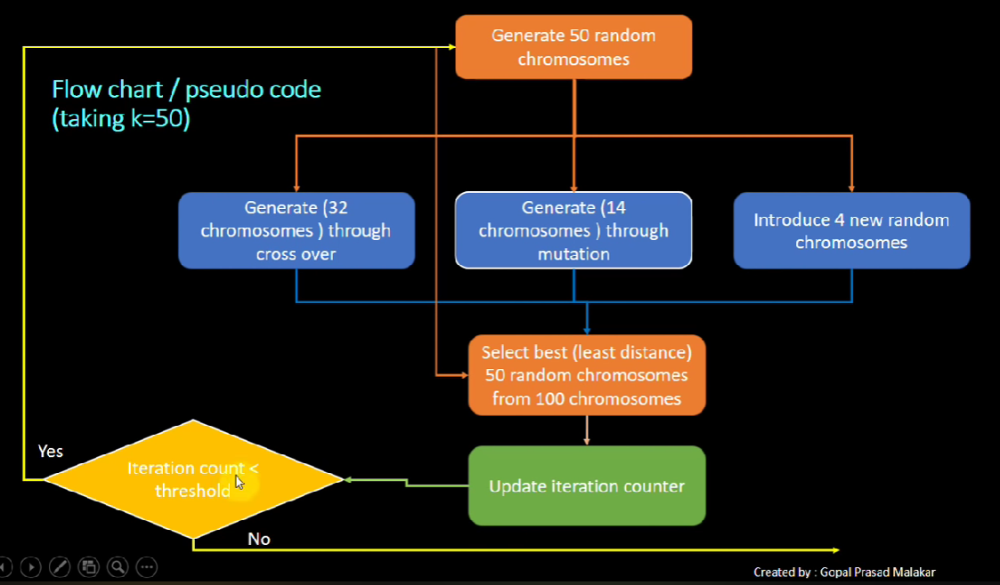

# Genetic Algorithm in TSP
## Giới thiệu chung
- TSP là bài toán NP khó, việc duyệt toàn bộ có độ phức tạp rất lớn, vì vậy cần tìm những giải thuật chỉ xem xét một không gian con lời giải và tìm kiếm lời giải gần đúng trong đó
- Genetic algorithm lấy cảm hứng từ việc tiến hóa trong tự nhiên, lấy lời giải làm cá thể và tự động sinh ra các cá thể mới rồi chọn lọc chúng
## Components
- Node : 1 thành phố trong TSP
- Individual: 1 lời giải dưới dạng mảng
- Route : 1 tập hợp các node decode từ Individual, dùng để tính tổng khoảng cách -> fitness và hiển thị trên GUI
- Population: Tập hợp lời giải đang xem xét
- Individual Comparator: Compare Individual dựa trên fitness
## Algorithm
- Flow chart: 
    
- Crossover : Sự kết hợp giữa hai lời giải giống với cơ chế lai tạo trong sinh học, với khả năng tạo ra lời giải kế thừa điểm tốt của cả 2 lời giải đầu vào
+ Ordered crossover: Lấy 1 phần từ cha, phần còn lại duyệt trong mẹ, gene nào chưa có thì tìm vị trí trống gần nhất trong con để gán vào
+ Partially mapped crossover: Tương tự nhưng sử dụng map và thay đổi cách tìm những gene còn lại trong mẹ
- Mutation : Tạo ra lời giải mới bằng cách thay đổi lời giải cũ, với khả năng tạo ra lời giải tốt hơn, hoặc phần gene tốt.
+ Swap mutation : Chọn 2 vị trí, trao đổi giá trí tại 2 vị trí đó
+ Inverse mutation : Chọn một đoạn trong gen, lật ngược đoạn đó
- Generate random : Tạo ra lời giải mới ngẫu nhiên hoàn toàn
- Chọn lọc thế hệ tiếp theo : Giống chọn lọc tự nhiên trong thực tế, chọn những cá thể có fitness tốt nhất ( tổng khoảng cách ngắn nhất) để giữ lại những gen tốt nhất
## GUI
- Hiển thị mỗi node theo tọa độ
- Tạo route là list các node, tạo line nối 2 node liên tiếp trong list
- Hiển thị log tiến hóa